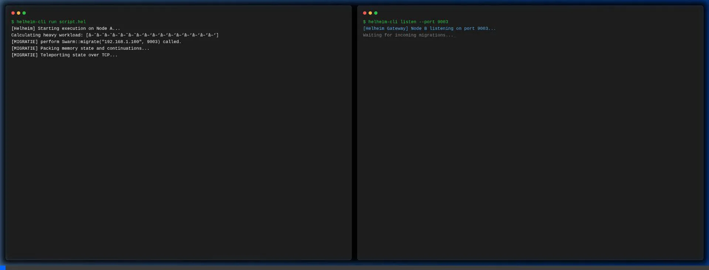

# Helheim Engine v2.0 (Alpha)

> Alpha release. See LICENSE for usage terms.

**Helheim** is a bare-metal, distributed, and zero-overhead execution engine for the CodeTaal (Dutch syntax) language, designed from the ground up for high-performance and robust system orchestration.

<p align="center">
  
</p>

*English below*

---

## Nederlands (Dutch)

### Wat is Helheim?
Helheim is meer dan een scripttaal. Het is een "Motor Cortex" voor je systeem:
- **Zero-Overhead FFI**: Direct inladen van C/C++ libraries zonder wrapper-overhead.
- **Algebraïsche Effect Handlers**: Scheid logica van I/O (zoals netwerk of file access) via krachtige `perform` en `handle` blokken.
- **Actor Model & Supervisor (Swarm)**: Ingebouwd lokaal (zero-copy MPSC) en gedistribueerd berichtenverkeer voor extreem parallelle taken. 100% Actor-Supervisor capabel met ingebouwde faalstrategieën (Escalate, Restart, Stop).
- **Continuations & Distributed Teleportation**: Pauzeer en verplaats actieve processen naadloos tussen verschillende machines (`perform Swarm::migrate`).
- **Flight Recorder**: Zero-overhead tracing en telemetrie ingebouwd in de virtuele machine.
- **Hardware JIT & Inline Assembly**: Directe toegang tot NVIDIA PTX via `asm ptx` blokken voor ongeëvenaarde controle.
- **Cryptografisch Beveiligd**: Packages en plugins worden geverifieerd via Ed25519.

### Starten
Zorg ervoor dat Rust en Cargo geïnstalleerd zijn.

```bash
# Start de Helheim REPL
cargo run --bin helheim-cli

# Draai een script
cargo run --bin helheim-cli run examples/reacq_full.hel

# Start de Universal Gateway (API)
cargo run --bin helheim-gateway
```

Zie `CHEATSHEET.md` voor de syntax en veelgebruikte concepten.

---

## English

### What is Helheim?
Helheim is a bare-metal, high-performance execution engine parsing a Dutch-syntax language (CodeTaal). It's designed as the "Motor Cortex" for complex, distributed systems:
- **Zero-Overhead FFI**: Load C/C++ libraries directly without wrapper-overhead.
- **Algebraic Effect Handlers**: Cleanly separate logic from side-effects (like I/O) using `perform` and `handle`.
- **Actor Model & Supervisor (Swarm)**: First-class support for local (zero-copy MPSC) and remote message passing for massive concurrency. 100% Actor-Supervisor capable with built-in failure strategies (Escalate, Restart, Stop).
- **Continuations & Distributed Teleportation**: Seamlessly pause and migrate active processes across different machines (`perform Swarm::migrate`).
- **Flight Recorder**: Built-in zero-overhead telemetry and tracing directly at the VM level.
- **Hardware JIT & Inline Assembly**: Direct NVIDIA PTX access via `asm ptx` blocks for unparalleled hardware control.
- **Cryptographically Secured**: Signed and verified packages via Ed25519 cryptography.

### Getting Started
Ensure you have Rust and Cargo installed.

```bash
# Start the Helheim REPL
cargo run --bin helheim-cli

# Run a script
cargo run --bin helheim-cli run examples/reacq_full.hel

# Start the Universal Gateway (API)
cargo run --bin helheim-gateway
```

See `CHEATSHEET.md` for syntax examples and core concepts.

---

### The Origin Story 
Helheim wasn't born in a corporate boardroom; it was born out of sheer frustration. I am an architect at heart, not a line-by-line typist. I see systems as massive interconnected patterns, fueled by an ADHD brain that processes architecture faster than traditional coding environments allow. 

Existing languages forced me into their rigid structures. I needed a language that mapped directly to my way of thinking—a hyper-fast, bare-metal "Motor Cortex" where logic goes straight to the hardware. So, together with a specialized team of AI agents executing the heavy lifting under my architectural direction, I built it myself.

The goal? Making distributed computing truly accessible. A world where code teleports to the data, instead of the other way around. This didn't exist yet, so here it is.

— **Pepijn (PEPAI)** | *pep_ai@icloud.com*

## License — BSL 1.1 © PEPAI
